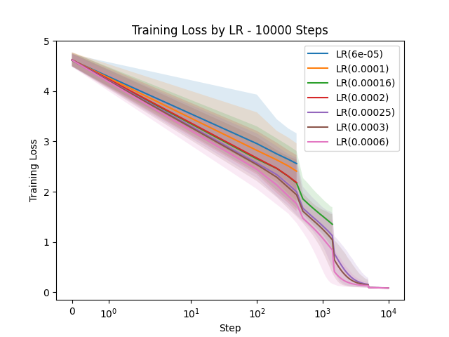
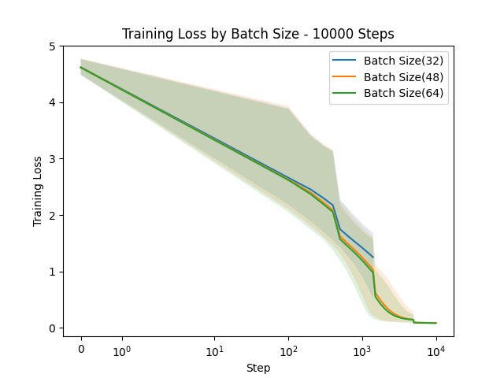
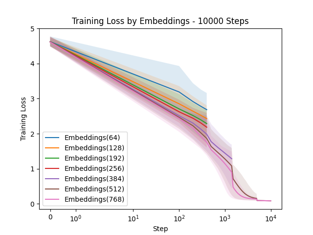
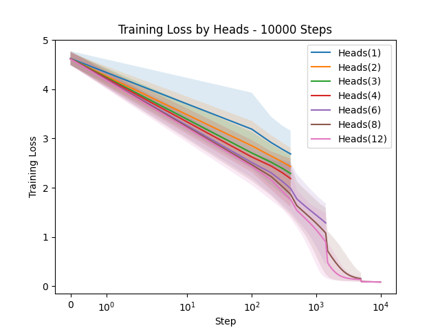
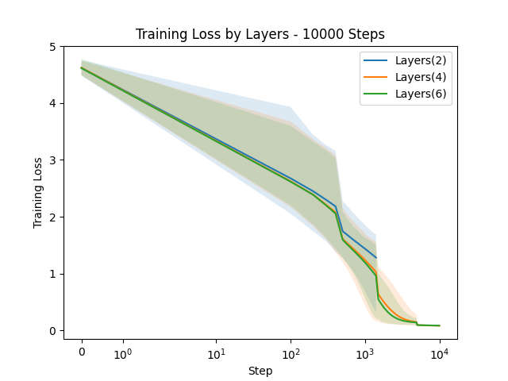
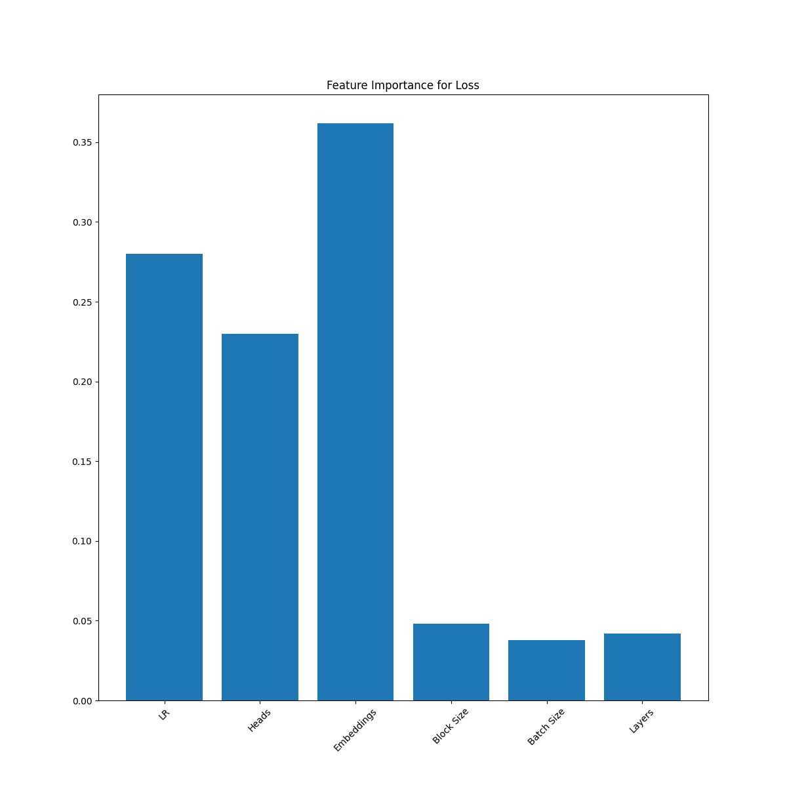
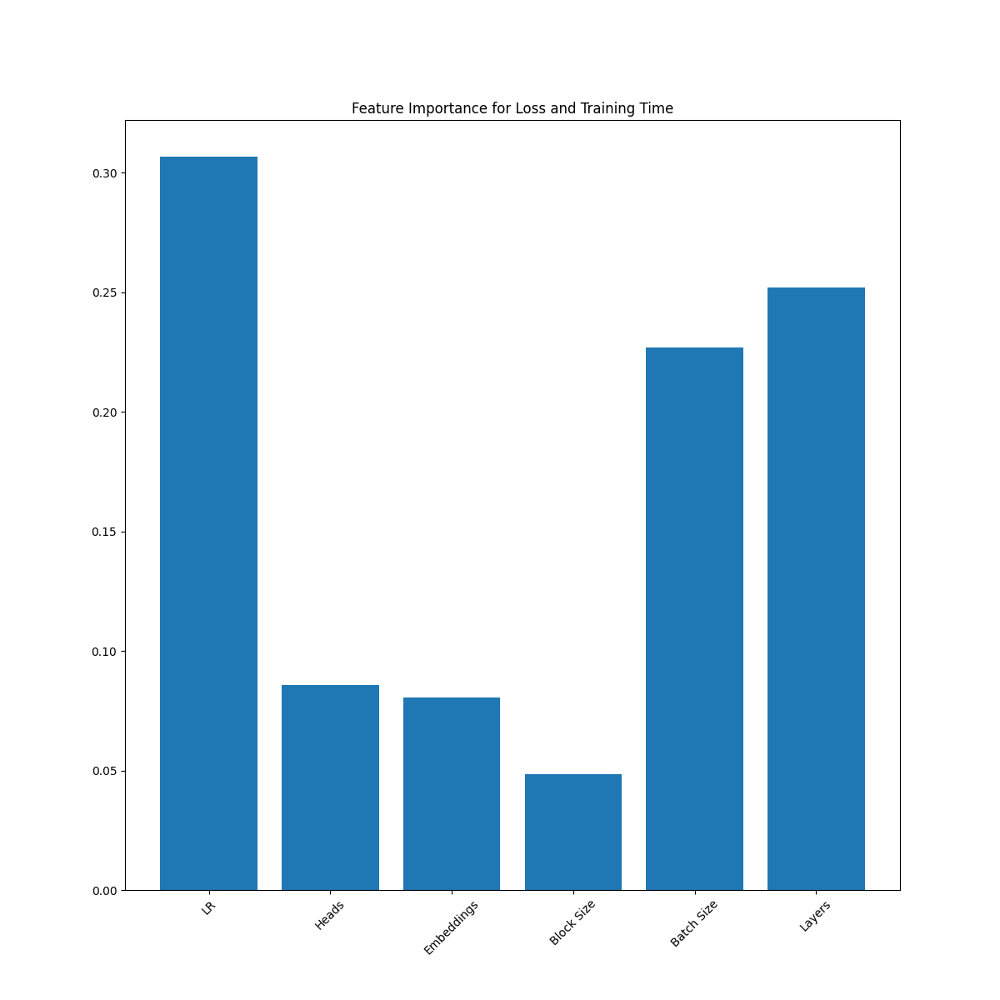
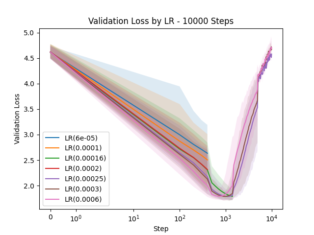
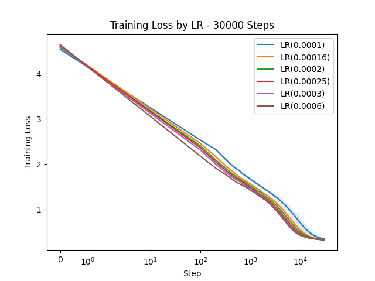
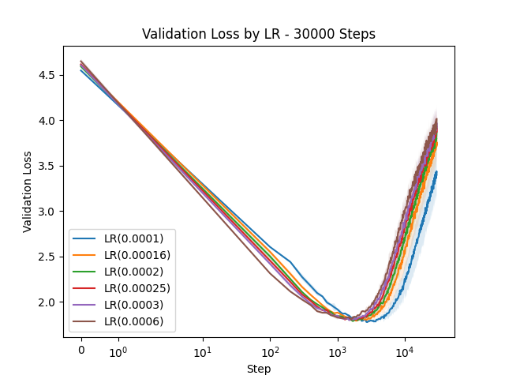

# liteGPT
Exploration and tweaking of Karpathy's nanoGPT (from his video: "Let's build GPT")

---
## Code Changes
Changes made from the original video version of the nanoGPT code include:
* Adding CUDA support
* Added mixed precision support (Autocast with GradScalar) - about 45% speed up from initial CUDA support.
* Added CUDA auto tuning, which improved performance ~10% on the development laptop.
* Ability to adjust hyperparameters to mimic other GPT models (GPT-3 sizes do not run on the development laptop, which only has 8 GB GPU)
* Support for phased analysis of various hyperparameters

---
## Experimentation Phases
To explore hyperparameters impact on the GPT framework, four phases were run against a novella (which has 112,191 letters in length):
1) 1316 hyperparameter permutations for 500 iterations of training time. Models are between 112K and 42.7M parameters. 
2) From the 50 best experiments, the hyperparameters were narrowed down to 320 permutations running for 1,500 iterations of training.  Models are between 3.6M and 42.7M parameters.
3) From the best of those experiments, 45 permutations running for 5,000 iterations.  Models are between 12.7M and 42.7M parameters.
4) 8 permutations of the best hyperparameter settings for 10,000 iterations.  Models are between 19M and 42.7M parameters.

## Training Loss
### By Learning Rate
Higher learning rates got to a lower error rate quicker.

### By Batch Size
Higher batch sizes got to a lower error rate quicker.

### By Block Size
Higher block sizes got to a lower error rate quicker.

### By Embeddings
The two highest embeddings counts got to lower error rates quicker, with 512 performing slightly better than 768.  This could be a function of GPU constraints.

### By Heads
Based on the constraints (the number of heads is 1/64th of the embedding size) the analysis matches Embeddings.

### By Layers
6 Layers were slightly better than 4 layers.

## hyperparameter Feature Importance for Training Loss
Learning Rates and Embeddings/Heads are most important for quality.

## hyperparameter Feature Importance for Training Loss and Training Time
Learning Rates, Batch Size, and Layers have the most impact on training on time.  This suggest to that to find the best quality training time,
Learning Rate and Embeddings should be as higher, but Batch Size and Layers should be lower.

## Visualizing the meaning of Training Loss
| Phase | Loss | Generated Text (100 Characters)                                                                                   |
| :---: | :---: |:------------------------------------------------------------------------------------------------------------------|
| 1 |  3.14       | tKyp\niq orataVn s ar\nWs ’s  ffhe o atdea sefn ffedio t Hcw\nti Esxa ta?iAirahor9hiolshed alkses  tdi          
| 1 | 3.01       | ShedOta. wsc\nrI\n/. hu isamld bnf sd TAal\nctg"atoyoqst•eN Oa)oton t:eMsn aseoS €ond atndn“EhaAon !n       
| 1 | 2.75       | t at.eus Tathemeous Zhinoup bellavrmat af taed his hhdZTed hheced le HHhe\nGrecres Heelellif Gro asof             |
| 1 | 2.5        | nigh wray charts Phesa banie areegisratclat nd ye awer cerapowm tesloraDgend ck hiy anod cema sthemo              |
| 1 | 2.25       | not brethe wat outeit kn yommm to." "Meis\nGra.\nTHed Thel a, avish ist. sour w abllamamu s thedilmate            |
| 1 | 2.0        | Thacked aleg, is nubly as osk the\nthrould newe as hund Mn more geld tok! OI A Thumane tuone of mou a             |
| 1 | 1.75       | 43M%OEE;S."\nPEAN, be smill mpely back one ck nolreage to stend\nbe dart, to as eapes witribling. If w            |
| 1 | 1.5        | have feemans ther!" Ting bared to his shoNm foure\nhim maeuw suppeded sho con and the mace. The the c             |
| 1 | 1.35       | Your fur."\n"Noot ther you must proct human to the was powed operfuren\nwith them, he sail. I have the            |
| 2 | 1.25       | smiled, "I am please Roi."\nNamal's suhmed and seemed, "Why with\nit boght a lours const our pilate to            |
| 2 | 1.0        | stompodabes quickly heart. Juckles and for King Anayah.\n65\nCHAPTE ROF I – THE JUDGE THE PETERATE ent          |
| 2 | 0.75       | Elyong Ri abanslave. If we want, we could fifly\nmay Yah Elyon!" He could smiled.\nThe tuons row soldi            |
| 2 | 0.52       | odden whis worships.\nTuon till help us were maeuw and wait filled with arcries\nwere scrime were nang            |
| 2 | 0.3        | "Yes, sir!" Gor ran to their ran attacked through his\ntroops out and slaves. The cubs were surroundi             |
| 3 | 0.25       | Clans and expect them to -Biber ence is and everyone, he surprised\nas the remaining warriors said, a             |
| 3 | 0.15 | a smell of thonishmen. After 62\nCHAPTER V – A DESPERATE GAMBIT\ncellent chief, who is great among the          |
| 3 | 0.11 | worships.\n"Yes, the first to roop if their growling. He knew he muster and sat\ndown again.\nGratta ha           |
| 4 | 0.10 | taskmaster winced. Whether it was from the implied\nyoursuing through the camp toward him. He stood\na            |

## Validation Loss (example)
The training approach used was to take the first 90% of the novella for training data, 10% for validation data.  
At some point the validation loss stops dropping and rising, and normally this would indicate overfitting but I suspect
enough differences exist between the first 90% and last 10% of a story that overfitting doesn't occur at step 1,000 as indicated in the chart.

## Smaller Model Evaluation
Two phases of smaller models were evaluated.  The batch, layer, and block sizes were set to the smallest of the hyperparameter values previously experimented on (32, 2, and 32 respectively).

Of note is that with these smaller sizes of batch, layer, and block, some overfitting was observed in the generated text, such as identical quoting of multiple phrases in the training text.

## Input Cleanup
* Fixed text breakages (sometimes Drop Cap caused text reordering)
* Text wraps based on original PDF, not at natural breaks such as paragraphs.
* Removed author's name (which started at each odd page header)
* Removed chapter title (which started at each even page)
* Standardized double quotes (got rid of smart quotes)

## Next Steps
- [x] Try low parameter count models for longer iterations
- [ ] Explore cleaning input
- [ ] Explore Quantization
- [ ] Explore strategies for training LLM on a single GPU
- [ ] Explore a larger corpus
- [ ] Explore bigram and trigram prediction abilities
- [ ] Explore tokens as words
- [ ] Identify and implement other transformer strategies in research
- [ ] Explore implmenting the full encoder/decoder architecture of GPT-2
- [ ] ...